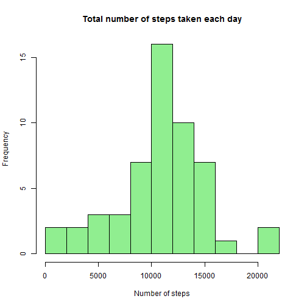
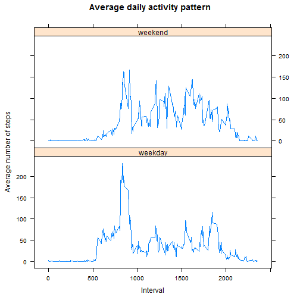

## Code book

This assignment makes use of data from a personal activity monitoring device. This device collects data at 5 minute intervals through out the day. The data consists of two months of data from an anonymous individual collected during the months of October and November, 2012 and include the number of steps taken in 5 minute intervals each day.

The data for this assignment can be downloaded from the course web site:

* **Dataset**: [Activity monitoring data](https://d396qusza40orc.cloudfront.net/repdata%2Fdata%2Factivity.zip) [52K]


The variables included in this dataset are:

* **steps**: Number of steps taking in a 5-minute interval (missing values are coded as NA)
* **date**: The date on which the measurement was taken in YYYY-MM-DD format
* **interval**: Identifier for the 5-minute interval in which measurement was taken


The dataset is stored in a comma-separated-value (CSV) file and there are a total of 17,568 observations in this dataset.


## Loading and preprocessing the data

The data is assumed to have been downloaded and extracted in the current directory.  The first step is to load the data into memory:

```r
data.raw <- read.csv('activity.csv', header=TRUE)
summary(data.raw)
```

```
##      steps                date          interval     
##  Min.   :  0.00   2012-10-01:  288   Min.   :   0.0  
##  1st Qu.:  0.00   2012-10-02:  288   1st Qu.: 588.8  
##  Median :  0.00   2012-10-03:  288   Median :1177.5  
##  Mean   : 37.38   2012-10-04:  288   Mean   :1177.5  
##  3rd Qu.: 12.00   2012-10-05:  288   3rd Qu.:1766.2  
##  Max.   :806.00   2012-10-06:  288   Max.   :2355.0  
##  NA's   :2304     (Other)   :15840
```


Here we have chosen to not pre-process the raw data any further.  One could perhaps remove the rows with missing values (`NA`), but since at this point we are not sure about what type of analysis will be performed, we decided to leave it as is.  One way to remove the missing values is as follow:

```r
data <- data.raw[complete.cases(data.raw),]
```

Therefore, further analysis  has to be a little more cautious, as a lot of functions will return `NA` if any of the values they operate on are missing (`mean` is an example of such function).


## What is mean total number of steps taken per day?

### Histogram of the total number of steps taken each day

In this step, the total number of steps taken is aggregated by day with the function `ddply`:

```r
library(plyr)
library(dplyr)

data <- ddply(data.raw, .(date), summarize, count=sum(steps))
```


The histogram of the total number of steps taken each day is displayed, with a bin size of 10 (rather than the default 5) to get a better view of the overall distribution:

```r
hist(
    x      = data$count,
    breaks = 10,
    col    = "lightgreen",
    main   = "Total number of steps taken each day",
    xlab   = "Number of steps"
)
```

 


### Mean and median total number of steps taken per day

The mean and median of the total number of steps taken each day are as follow (`NA` values are ignored) :

```r
mean(data$count, na.rm=TRUE)
median(data$count, na.rm=TRUE)
```

```
## [1] 10766.19
```

```
## [1] 10765
```

There are approximately 10,765 steps taken per day, on average.


## What is the average daily activity pattern?

### Time series plot of 5-minute interval

This time around, the data is aggregated along the *interval* column (the average is used here instead of the total count).

The number of steps is averaged accross all days (y-axis) and the missing values (`NA`) are removed from the calculation of the average:

```r
data <- ddply(data.raw, .(interval), summarize, average=mean(steps, na.rm=TRUE))
```

The time series plot of the 5-minute interval (x-axis) and the average number of steps taken is displayed as follow:

```r
plot(
    x    = data$interval,
    y    = data$average,
    type = 'l',
    main = 'Average daily activity pattern',
    xlab = 'Interval',
    ylab = 'Average number of steps'
)
```

 


### 5-minute interval with the most steps

Now we can calculate which 5-minute interval, on average across all the days in the dataset, contains the maximum number of steps:

```r
data[which.max(data$average),]
```

```
##     interval  average
## 104      835 206.1698
```

On average, the 8:35 interval contains the maximum number of steps (~206).


## Imputing missing values

### Proportion of missing values

In this step, we take a closer look at the missing values (rather than just ignoring them as has been done so far).

First, the total number of missing values (`NA`) is calculated, along the percentage:

```r
num_na     <- sum(is.na(data.raw$steps))
percent_na <- num_na / dim(data.raw)[1] * 100
```

```
## [1] 2304
```

```
## [1] 13.11475
```

There are 2,304 missing values in this dataset, which is about 13% of the total data.  This proportion is fairly big, and could yield erroneous results when not dealt with appropriately.


### Filling strategy

The missing values (`NA`) in the *steps* column will be filled in with the mean value over the whole data for the corresponding 5-minute interval (excluding the missing values themselves).

We can use the `ave(...)` function for this, by making sure to aggregate against the *interval* column, and to remove all rows with missing values (`na.rm=TRUE`):

```r
ave(data.raw$steps, data.raw$interval, FUN=function(x) mean(x, na.rm=TRUE))
```


### New dataset

Creating the new dataset requires a few steps:

* clone the original dataset
* calculate the aggregate mean values for each 5-minute interval...
* ... and add them as a new column in the data frame
* replace the missing values with the corresponding mean (from this new column)
* remove the new column to keep the data tidy

```r
data.clean      <- data.raw
data.clean$mean <- ave(data.clean$steps, data.clean$interval, FUN=function(x) mean(x, na.rm=TRUE))

data.clean[is.na(data.clean$steps),]$steps <- data.clean[is.na(data.clean$steps),]$mean

data.clean$mean <- NULL
```


### New histogram and mean/median

We can now re-plot and re-calculate the mean and median values based on this new dataset:

```r
data <- ddply(data.clean, .(date), summarize, count=sum(steps))

hist(
    x      = data$count,
    breaks = 10,
    col    = "lightgreen",
    main   = "Total number of steps taken each day",
    xlab   = "Number of steps"
)
```

 

```r
mean(data$count)
median(data$count)
```

```
## [1] 10766.19
```

```
## [1] 10766.19
```

Even though the histogram changed quite a bit (frequency wise, not shape wise), there are no significant differences between the new values and the ones from the first part of the assignment.  In this case, imputing missing data had close to no impact on the estimates of the total daily number of steps.  This could be caused by:

* either a side-effect of the imputation strategy
* or the fact that all the `NA` values were previously removed from the calculations (`na.rm=TRUE`)


## Are there differences in activity patterns between weekdays and weekends?

### New factor variable

A new factor variable is added in the data frame to indicate if an observation happened on a weekday or on the weekend (the whole column is first iniitalized to `weekday`, and weekend days are overwritten with `weekend`:

```r
data.clean$typeOfDay <- "weekday"
data.clean[weekdays(as.Date(data.clean$date))=="Saturday",]$typeOfDay <- "weekend"
data.clean[weekdays(as.Date(data.clean$date))=="Sunday",]$typeOfDay   <- "weekend"
```


### Panel plot

In this step, a panel plot containing a time series plot of the 5-minute interval (x-axis) and the average number of steps taken, averaged across all weekday days or weekend days (y-axis) is created (the data is aggregated and averaged according to the interval and the type of day):

```r
data <- ddply(data.clean, .(interval, typeOfDay), summarize, average=mean(steps))
```

And the panel plot is displayed as follow:

```r
library(lattice)

xyplot(
    average ~ interval | typeOfDay,
    data   = data,
    layout = c(1, 2),
    type   = 'l',
    main   = 'Average daily activity pattern',
    xlab   = 'Interval',
    ylab   = 'Average number of steps'
)
```

 
